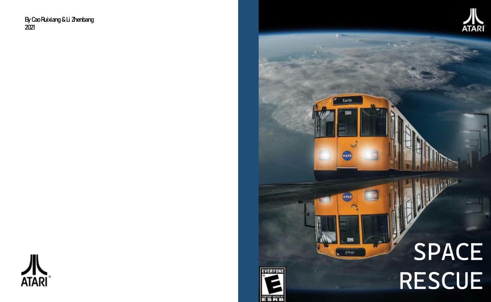

# CS110_Computer-Architecture
Projects of Shanghaitech _CS110 Computer-Architecture_ which based on:  
UCB _CS61C Great Ideas in Computer Architecture (Machine Structures)_  
See for details:  
https://robotics.shanghaitech.edu.cn/courses/ca/21s/  
https://inst.eecs.berkeley.edu/~cs61c/sp21/  

All these works are done with my teammate [@NextBG][1] , thanks for his works!

*****
## Projects Introduction
### Project 1: RISC-V Assembler & Disassembler

RISC-V - Machine Code assembler & disassembler.

### Project 2: CPU and Datapath

A simulated CPU with a whole Datapath, including all parts like ALUs and registers to accomplish a small RISCV instruction set. (Based on _Logisim_)

### Project 3: Crypto Coin Mining and Hash Function Optimization
The task is to use multiple methods like multithread to optimize the SHA256 hash function in a Crypto Coin mining process.
### Project 4: Longan_Board_RISC-V_Game
It is a RISC-V and C based  game on a [longan- nano][2]  board. We named it _SPACE RESCUE_. 
The ATARI-styled introduction booklet and outer controller hardware are build for fun and completion.

Booklet & Hardware:

[1]: https://github.com/NextBG

[2]: https://github.com/topics/longan-nano
